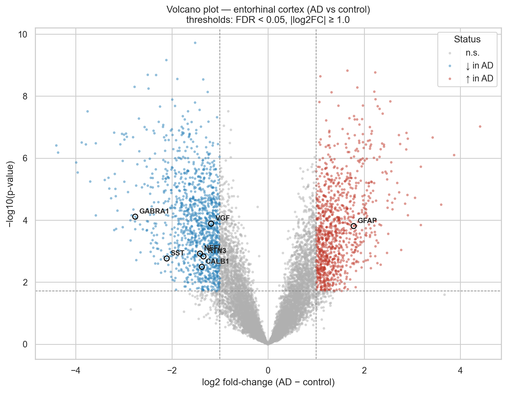
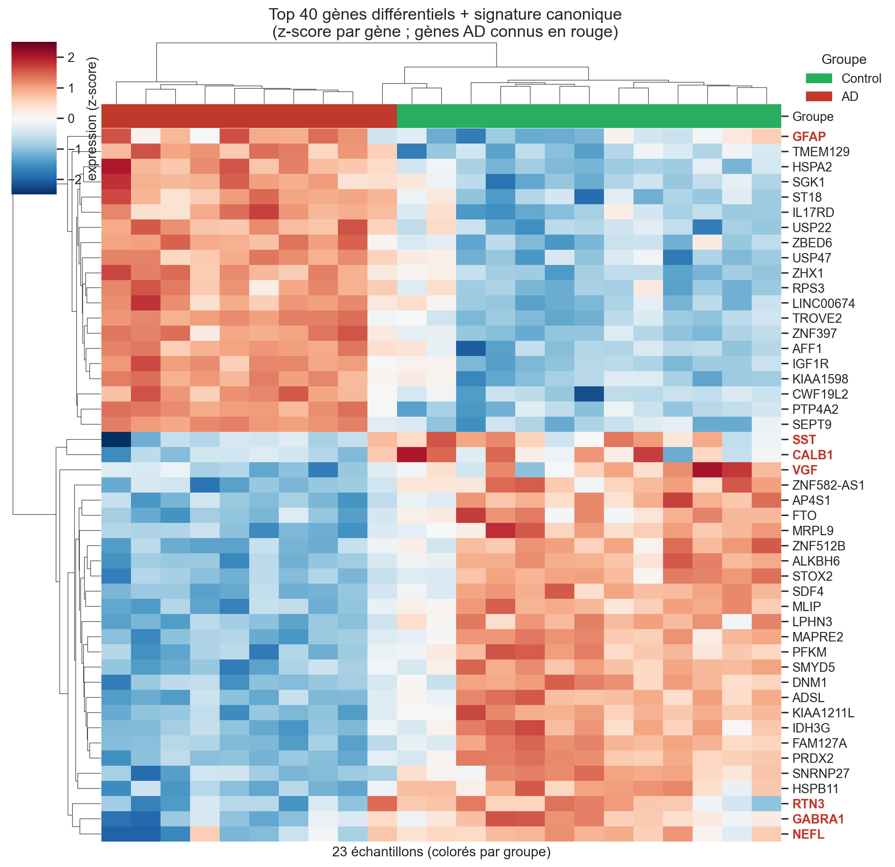
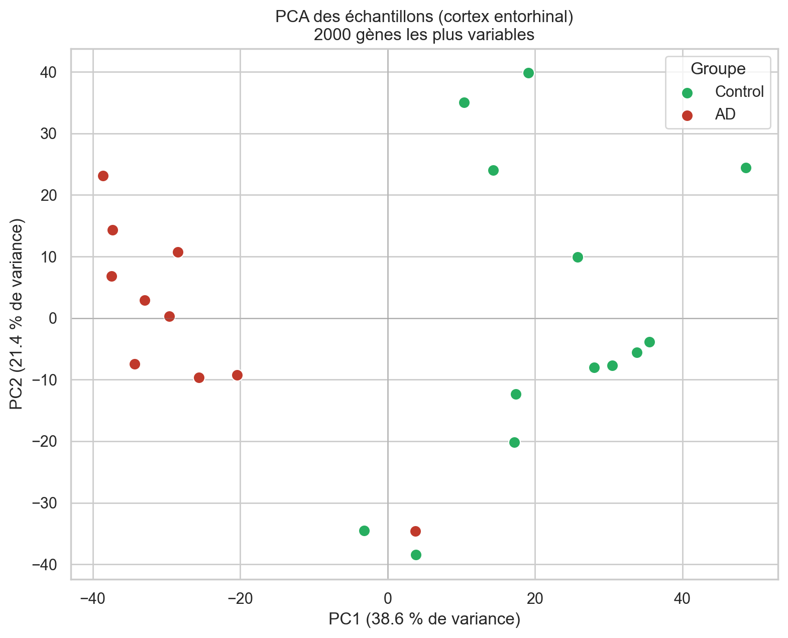

# Differential Gene Expression in Alzheimer's Disease — Entorhinal Cortex (GSE5281)

A reproducible transcriptomic analysis comparing brain tissue from **Alzheimer's disease (AD) patients** and **healthy aged controls**, focused on the **entorhinal cortex** — the earliest region affected by AD pathology.

> **About this project.** I am a **PhD in biology specialised in Alzheimer's disease**, training as a **data scientist**. This project sits deliberately at that intersection: a clean, well-engineered Python pipeline (modular `src/`, version-controlled notebooks, reproducible environment) applied to a question I understand at the bench level. The goal is not only to recover a known biological signature, but to make every methodological choice explicit and defensible — the way a life scientist who codes should work.

---

## Why the entorhinal cortex?

Alzheimer's disease does not strike the brain uniformly. Neurofibrillary degeneration begins in the **entorhinal cortex** (Braak stages I–II), long before symptoms appear. Restricting the analysis to this single region — rather than pooling heterogeneous brain areas — keeps the biological signal coherent and the results directly interpretable.

**Dataset.** [GSE5281](https://www.ncbi.nlm.nih.gov/geo/query/acc.cgi?acc=GSE5281) (Liang *et al.*, 2008), Affymetrix Human Genome U133 Plus 2.0 microarray (GPL570, 54,675 probes), laser-captured neurons across several brain regions. After filtering to the entorhinal cortex:

| Group | n |
|-------|---|
| Alzheimer's disease | 10 |
| Healthy aged control | 13 |
| **Total** | **23** |

---

## Pipeline

The analysis is split into four narrated notebooks, backed by reusable functions in [`src/`](src/).

| Notebook | Step | Key choices |
|----------|------|-------------|
| [`01_data_acquisition`](notebooks/01_data_acquisition.ipynb) | Download GSE5281 via `GEOparse`, local caching | — |
| [`02_exploration_qc`](notebooks/02_exploration_qc.ipynb) | Sample metadata, group counts, QC | log2 transform · quantile normalization |
| [`03_differential_expression`](notebooks/03_differential_expression.ipynb) | Probe filtering, collapse, statistics | ABS_CALL filter · max-mean collapse · Welch *t*-test · Benjamini-Hochberg |
| [`04_visualization_biology`](notebooks/04_visualization_biology.ipynb) | Figures + biological interpretation | volcano · heatmap · PCA |

**Methodological decisions, made explicit:**

- **Quantile normalization** (after log2) — per-array medians ranged 35→117 (≈3.3× spread); aligning the full distribution, not just the median, makes arrays comparable for probe-wise testing.
- **Probe detection filter (`ABS_CALL`)** — keep probes called *Present* in at least `k` samples, with `k =` size of the smallest group (here **10**). This preserves markers specific to one group while removing ~35% of probes that are pure background. 54,675 → **19,202** probes.
- **Probe → gene collapse (max-mean)** — per gene, keep the probe with the highest mean intensity (best signal-to-noise). Probes with **no gene symbol** (2,070) or **multiple symbols** (1,025) are discarded rather than mapped arbitrarily. Final matrix: **10,571 unique genes**.
- **Welch's *t*-test** — unequal variances and unbalanced groups (10 vs 13); more robust than Student's *t*-test at no cost when variances are equal.
- **Benjamini-Hochberg** — controls the false discovery rate across ~10,000 simultaneous tests.

---

## Results

**4,082 genes** are differentially expressed at **FDR < 5 %**; **2,156** also exceed a 2-fold change (|log2FC| ≥ 1) — **990 up** and **1,166 down** in AD.

### Volcano plot
Genome-wide view of effect size vs significance. Canonical AD genes are circled and labelled.



### Heatmap — top differential genes + canonical signature
Per-gene z-scores; samples and genes clustered by similarity. The two groups separate into coherent blocks; known AD genes are highlighted in bold red.



### PCA of samples
Unsupervised projection on the 2,000 most variable genes. **PC1 (38.6 % of variance) separates AD from controls without ever using the group labels** — an independent confirmation that the differential signal dominates the data.



---

## Biological interpretation

### The canonical AD signature is recovered

| Gene | log2FC (AD − ctrl) | FDR | Expected role | Direction |
|------|-------------------:|----:|---------------|-----------|
| **GFAP** | +1.78 | 0.0014 | Reactive astrogliosis | ↑ as expected |
| **CD44** | +2.91 | 0.001 | Glial / inflammatory | ↑ as expected |
| **SPP1** | +2.91 | <0.001 | Glial / inflammatory | ↑ as expected |
| **GABRA1** | −2.76 | 0.0009 | GABAergic synaptic | ↓ as expected |
| **SST** | −2.11 | 0.0078 | Interneuron marker | ↓ as expected |
| **NEFL** | −1.41 | 0.0059 | Neurofilament (neuronal) | ↓ as expected |
| **CALB1** | −1.38 | 0.0125 | Calcium-binding neuronal | ↓ as expected |
| **RTN3** | −1.34 | 0.0069 | Neuronal, APP processing | ↓ as expected |
| **VGF** | −1.18 | 0.0012 | Neurosecretory / synaptic | ↓ as expected |

*Literature anchor:* consistent with the dataset's origin study (Liang *et al.*, PNAS 2008) and subsequent entorhinal-cortex transcriptomics — a shift from a **neuronal** program (repressed) toward a **glial/inflammatory** program (activated).

#### The glial/neuronal switch

The entorhinal cortex holds a distinctive place in the timeline of Alzheimer's disease: it is one of the first regions invaded by tau pathology, well before clinical symptoms emerge. This early vulnerability makes it an ideal window onto the disease — and it explains why the transcriptomic signature observed here is so sharply defined.

What this tissue reveals is a dual, mirror-image dynamic. On one side, the neuronal and synaptic compartment collapses. Neurons die, synapses are lost, and with them go their characteristic markers: SST (somatostatin, inhibitory interneurons), GABRA1 (GABA-A receptor), NEFL (neurofilament light, axonal integrity), CALB1 (calbindin, specific neuronal populations), and VGF (a neuropeptide involved in synaptic plasticity). All are downregulated — not as an artifact, but as a direct consequence of neuronal depopulation.

On the other side, glia respond. Under assault, astrocytes activate and enter a state of reactive astrogliosis: they proliferate, hypertrophy, and overexpress GFAP (Glial Fibrillary Acidic Protein), their structural marker. This is not a sign of repair — it is an inflammatory response to ongoing damage, and its magnitude reflects the severity of the surrounding neurodegeneration.

These two movements are inseparable: neither can be understood except in light of the other. Neuronal loss drives the glial reaction; the glial reaction bears witness to the neuronal loss. This is the signature expected of an actively neurodegenerating tissue.

The volcano plot makes this dynamic immediately legible. To the left, a cluster of neuronal and synaptic genes — SST, GABRA1, NEFL, CALB1, VGF — significantly downregulated. To the right, standing alone, GFAP: upregulated and isolated, like the final alarm signal of a tissue losing its neurons. The symmetry is no coincidence — it is the visual translation of a coherent biological mechanism, and it is precisely what a good volcano plot should let you see.

### The "famous" AD genes are NOT differentially expressed — and that is expected

| Gene | log2FC | FDR | Significant? |
|------|-------:|----:|:---:|
| APP | +0.34 | 0.080 | no |
| MAPT (tau) | +0.00 | 0.993 | no |
| PSEN1 | −0.08 | 0.841 | no |
| APOE | −0.41 | 0.396 | no |

These genes drive AD through **post-translational** mechanisms (APP cleavage, tau hyperphosphorylation, APOE isoforms) — not mRNA abundance. A transcriptomic analysis *cannot* be expected to flag them.

#### The "post-translational" genes

Alzheimer's most emblematic genes — MAPT, APP, PSEN1, APOE — do not appear as differentially expressed in this analysis. This is not a blind spot: it is the expected behavior.

Their role in the pathology does not run through transcriptional dysregulation. MAPT produces tau protein at normal levels; it is its hyperphosphorylation that turns it pathological. APP is expressed at stable levels; it is its cleavage by secretases that generates the amyloid peptides. PSEN1 encodes the catalytic subunit of the γ-secretase complex — its contribution lies in that cleaving activity, not in its own transcript abundance. APOE acts through its protein isoforms, whose properties differ radically by allele — a distinction invisible at the mRNA level. A differential expression analysis measures transcript levels; it is, by construction, blind to these post-translational mechanisms.

The absence of these genes from the results is therefore information in itself: it confirms that the tool used is consistent with what we know of the biology. What the volcano plot shows — neuronal collapse, glial reaction — are the tissue-level consequences of these upstream molecular mechanisms. The two readings are complementary, not competing.

### Methodological caveats (scientific honesty)

Modest sample size (10 vs 13); microarray data (2007), less sensitive than current RNA-seq; age/sex verified comparable between groups (notebook 02) but not explicitly modelled; the high proportion of significant genes (~39 %) reflects a genuinely strong biological effect *and* the absence of a multivariate model. A publication-grade analysis would use `limma` (linear model + empirical-Bayes moderated variance). These trade-offs are deliberate for a pipeline-focused portfolio project.

---

## Reproduce the analysis

```bash
pip install -r requirements.txt
# run the notebooks in order (01 → 04)
jupyter lab
```

GEO data is downloaded and cached automatically into `data/raw/` (not version-controlled). Python 3.14; all package versions pinned in [`requirements.txt`](requirements.txt).

---

## Project structure

```
alzheimer-gene-expression/
├── notebooks/      Narrated analysis, step by step (01 → 04)
├── src/            Reusable modules
│   ├── data_loader.py     GEO download + local cache
│   ├── preprocessing.py   metadata, expression matrix, log2, normalization,
│   │                      ABS_CALL filter, probe→gene collapse
│   ├── stats.py           Welch t-test, log2FC, Benjamini-Hochberg
│   └── plotting.py        volcano, heatmap, PCA
├── data/           raw/ + processed/ (not version-controlled)
├── results/
│   ├── figures/    publication-quality figures
│   └── tables/     full differential-expression table (CSV)
├── requirements.txt
└── LICENSE         MIT
```

---

## Skills demonstrated

- **Domain-driven analysis** — biological questions framing every technical decision (region choice, probe filtering, interpretation of null results).
- **Reproducible engineering** — modular `src/`, pinned environment, clean git history, data kept out of version control.
- **Statistics** — multiple-testing correction, robust hypothesis testing, normalization, unsupervised validation (PCA).
- **Communication** — narrated notebooks and figures legible to both technical and biological audiences.

---

## References

- Liang WS, *et al.* **Alzheimer's disease is associated with reduced expression of energy metabolism genes in posterior cingulate neurons.** *PNAS* (2008). — origin study of GSE5281.
- Benjamini Y, Hochberg Y. **Controlling the false discovery rate.** *J. R. Stat. Soc. B* (1995).
- Braak H, Braak E. **Neuropathological stageing of Alzheimer-related changes.** *Acta Neuropathol.* (1991).

---

*Data: NCBI GEO accession [GSE5281](https://www.ncbi.nlm.nih.gov/geo/query/acc.cgi?acc=GSE5281). Code released under the MIT License.*
